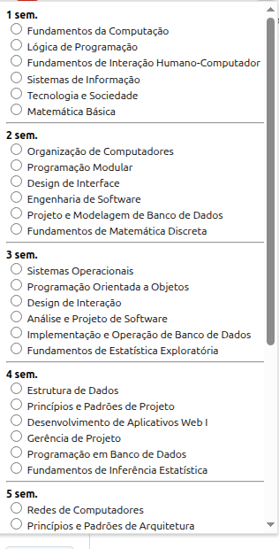
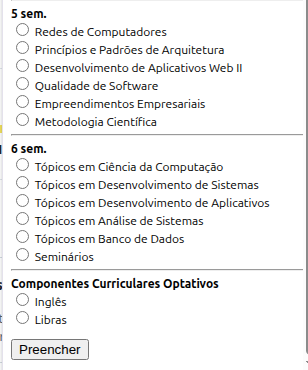

# SIGAA_AnaliseMatricula

Você coordenador precisa analisar intermináveis listas de rematrícula de alunos? Seus problemas acabaram com SIGAA_AnaliseMatricula.

## Instalação

1) Baixar a extensão SIGAAmes em formato .zip (https://github.com/IgorAvilaPereira/SIGAA_AnaliseMatricula/archive/refs/heads/main.zip)
2) Descompactar o .zip em algum diretório de sua escolha
3) No Google Chrome entrar em "More Tools >> Extensions"
4) Habilitar a opção "Developer mode"
5) Clicar no botão "Load unpacked"
6) Buscar a pasta descompactada do SIGAAmes
7) E a instalação está completa!!

## Uso

1. Primeiramente é preciso instalar a extensão em seu navegador baseado no chromium.

2. Depois da instalação, é preciso entrar no SIGAA com seu login e senha e acessar a página de análise de matrículas e selecionar algum aluno, conforme imagem abaixo:

3. Na página abaixo, clique no botão "Analisar" disponível na extensão e todos os checkboxes "Visto" serão marcados e o formulário, automaticamente, será submetido.

* obs: repita isso para os demais alunos.

## Observações

* A extensão foi desenvolvida e testada em uma máquina com Linux Mate e navegador Brave. 
* Fique a vontade para corrigir possíveis bugs (a extensão é open-source).
* É uma versão beta (e sempre será !!!). Use por sua conta em risco!
